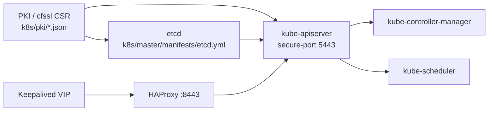
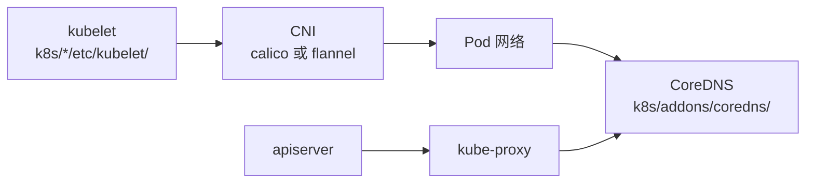
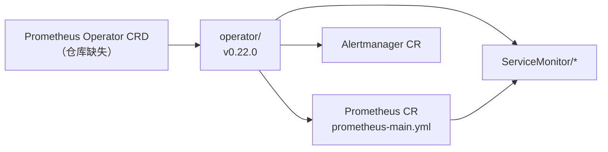

# Task 32 — 组件依赖图与安装顺序

**范围:** 仓库内 `k8s/` 清单（含 `archived/` 标注）与 `examples/current/` 对照。路径相对仓库根。

## 1. 控制面依赖链



## 2. 节点 / 网络 / DNS



> 仓库同时含 `addons/calico/v3.1/` 与 `addons/flannel/`；现网应二选一，勿并行。

## 3. Prometheus Operator → CRD → ServiceMonitor



## 4. EFK 链（已归档，禁止部署）


见 `k8s/archived/ARCHIVED.md`、`k8s/archived/efk/README.md`。

## 5. Ingress → Service → 应用


现代示例见 `examples/current/ingress/` + `examples/current/apps/`。

---

## 机器可读依赖清单

```yaml
# generated for Task 32 — paths relative to repo root
components:
  - name: pki-csr-templates
    path: k8s/pki/
    depends_on: []
    install_order: 1
    missing_deps: []
    notes: "CSR JSON only; issued PEMs not in repo"

  - name: etcd
    path: k8s/master/manifests/etcd.yml
    depends_on: [pki-csr-templates]
    install_order: 2
    missing_deps: []

  - name: keepalived
    path: k8s/master/manifests/keepalived.yml
    depends_on: []
    install_order: 3
    missing_deps: []
    notes: "VIP ownership; CHECK_PORT=2379 in static Pod"

  - name: haproxy
    path: k8s/master/manifests/haproxy.yml
    depends_on: [keepalived]
    install_order: 4
    missing_deps: []
    notes: "VIP:8443 → apiserver:5443; backend IPs 现网选定"

  - name: kube-apiserver
    path: k8s/master/manifests/kube-apiserver.yml
    depends_on: [pki-csr-templates, etcd, haproxy]
    install_order: 5
    missing_deps: []

  - name: kube-controller-manager
    path: k8s/master/manifests/kube-controller-manager.yml
    depends_on: [kube-apiserver, pki-csr-templates]
    install_order: 6
    missing_deps: []

  - name: kube-scheduler
    path: k8s/master/manifests/kube-scheduler.yml
    depends_on: [kube-apiserver, pki-csr-templates]
    install_order: 6
    missing_deps: []

  - name: kubelet-bootstrap-rbac
    path: k8s/master/resources/kubelet-bootstrap-rbac.yml
    depends_on: [kube-apiserver]
    install_order: 7
    missing_deps: []

  - name: apiserver-to-kubelet-rbac
    path: k8s/master/resources/apiserver-to-kubelet-rbac.yml
    depends_on: [kube-apiserver]
    install_order: 7
    missing_deps: []

  - name: kube-proxy
    path: k8s/addons/kube-proxy/kube-proxy.yml
    depends_on: [kube-apiserver]
    install_order: 8
    missing_deps: []

  - name: cni-calico
    path: k8s/addons/calico/v3.1/
    depends_on: [kube-apiserver]
    install_order: 9
    missing_deps: []
    notes: "mutex with flannel"

  - name: cni-flannel
    path: k8s/addons/flannel/kube-flannel.yml
    depends_on: [kube-apiserver]
    install_order: 9
    missing_deps: []
    notes: "mutex with calico"

  - name: coredns
    path: k8s/addons/coredns/coredns.yml
    depends_on: [kube-apiserver, cni-calico|cni-flannel]
    install_order: 10
    missing_deps: []

  - name: prometheus-operator-crds
    path: null
    depends_on: []
    install_order: 20
    missing_deps: ["Prometheus Operator CRD YAML not in repo"]
    notes: "Must install CRDs matching operator v0.22.0 before apply"

  - name: prometheus-operator
    path: k8s/ExtraAddons/prometheus/operator/
    depends_on: [prometheus-operator-crds]
    install_order: 21
    missing_deps: ["CRDs"]

  - name: prometheus-stack
    path: k8s/ExtraAddons/prometheus/
    depends_on: [prometheus-operator]
    install_order: 22
    missing_deps: ["CRDs", "kube-service-discovery Endpoints (example only)"]

  - name: ingress-nginx
    path: k8s/ExtraAddons/ingress-controller/
    depends_on: [kube-apiserver, coredns]
    install_order: 30
    missing_deps: []

  - name: external-dns
    path: k8s/ExtraAddons/external-dns/
    depends_on: [kube-apiserver]
    install_order: 31
    missing_deps: []

  - name: sample-nginx
    path: k8s/apps/nginx/
    depends_on: [ingress-nginx]
    install_order: 40
    missing_deps: []

  - name: efk-archived
    path: k8s/archived/efk/
    depends_on: []
    install_order: null
    missing_deps: ["do-not-install"]
    notes: "archived; Fluentd→ES→Kibana"

  - name: examples-current
    path: examples/current/
    depends_on: []
    install_order: 100
    missing_deps: []
    notes: "modern baseline; not a drop-in for k8s/ history"
```

## 修改摘要

### 风险
- Prometheus 栈在缺少 CRD 时 apply 会失败或留下残缺对象。
- Calico/Flannel 若同时启用会导致网络冲突。
- `archived/` 若被安装入口引用，会引入 EOL 与高危能力。

### 遗留
- Operator CRD 仍不在仓库；需外挂与 `v0.22.0` 匹配的 CRD 包或迁到 `examples/current/observability/` 现网发行版。
- kube-scheduler / controller-manager 的 discovery Endpoints 仅为 `endpoints.example.yml`。

### 回滚
- 文档-only；删除或还原本文件即可。不改变运行时。
