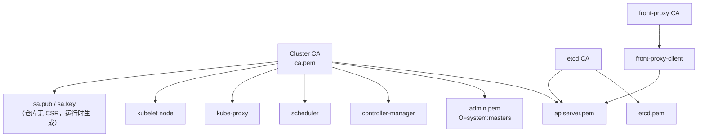

# Task 34 — PKI 生命周期审计

**范围:** `k8s/pki/*.json`（cfssl CSR / CA 配置）。
**重要:** 本仓库仅有 **CSR 模板**，**不含**已签发的 `.pem` / `.key`。CSR JSON ≠ 节点或控制面磁盘上的证书。

## 1. 模板字段一览

| 文件 | CN | O / OU（names） | hosts / SAN | key | 其他 |
|------|----|-----------------|-------------|-----|------|
| `ca-csr.json` | `kubernetes` | O=Kubernetes, OU=Kubernetes-manual | **无** | RSA 2048 | `ca.expiry`: 876000h |
| `ca-config.json` | — | — | — | — | profile `kubernetes` usages: signing, key encipherment, **server auth**, **client auth**；expiry 87600h |
| `etcd-ca-csr.json` | `etcd` | O=etcd, OU=Etcd Security | **无** | RSA 2048 | |
| `etcd-csr.json` | `etcd` | O=etcd, OU=Etcd Security | **无**（签发时用 `-hostname`） | RSA 2048 | |
| `apiserver-csr.json` | `kube-apiserver` | O=Kubernetes | **无**（必须在签发时加 VIP、kubernetes SVC IP、master DNS/IP 等） | RSA 2048 | |
| `admin-csr.json` | `admin` | **O=system:masters** | **无** | RSA 2048 | 等效高权客户端 |
| `manager-csr.json` | `system:kube-controller-manager` | O=同 CN | **无** | RSA 2048 | |
| `scheduler-csr.json` | `system:kube-scheduler` | O=同 CN | **无** | RSA 2048 | |
| `kube-proxy-csr.json` | `system:kube-proxy` | O=同 CN | **无** | RSA 2048 | |
| `kubelet-csr.json` | `system:node:$NODE` | O=system:nodes | **无**（按节点） | RSA 2048 | `$NODE` 占位 |
| `front-proxy-ca-csr.json` | `kubernetes` | （无 names） | **无** | RSA 2048 | |
| `front-proxy-client-csr.json` | `front-proxy-client` | — | **无** | RSA 2048 | 与 apiserver `--requestheader-allowed-names=aggregator` **不一致**，现网签发时需核对 CN |

**Key usages:** 仅在 `ca-config.json` 的 profile 中声明（server+client auth）；各 CSR 文件本身无独立 `usages` 字段。

## 2. 证书关系

运行时挂载见 `k8s/master/manifests/kube-apiserver.yml`（`/etc/kubernetes/pki`、`/etc/etcd/ssl`）。

## 3. 建议签发顺序

1. Cluster CA（`ca-csr.json` + 自签）与 etcd CA、front-proxy CA
2. etcd 服务器证（`-hostname` = 各 etcd 成员 IP/DNS，现网选定）
3. apiserver（SAN 含 `{{ VIP }}`、`kubernetes`、`kubernetes.default`、`kubernetes.default.svc`、SVC CIDR 首 IP、各 master 地址）
4. admin / CM / scheduler / kube-proxy
5. front-proxy-client（CN 与 apiserver aggregator 配置对齐）
6. ServiceAccount 密钥对
7. kubelet（bootstrap 或每节点签发）；节点加入后再轮换

## 4. 轮换手册大纲（运维）

1. **盘点:** 列出控制面与 etcd 证书路径、到期日、SAN。
2. **非 CA 轮换:** 新发 leaf → 分发 → 滚动重启 etcd（一次一员）→ apiserver → CM/scheduler → kube-proxy/kubelet。
3. **CA 轮换:** 双 CA 信任窗口 → 重签全部 leaf → 撤旧 CA；单独变更窗口。
4. **验证:** `openssl`/`cfssl` 检查链；`curl -k` 仅作连通，生产应校验主机名。
5. **回退:** 保留旧 PEM 至确认稳定；etcd 先快照。

## 5. 提议：`scripts/check-cert-expiry.sh` 设计（不必已实现）

| 项 | 设计 |
|----|------|
| 输入 | 目录列表（默认 `/etc/kubernetes/pki`、`/etc/etcd/ssl`）或显式文件列表；阈值天数字段（如 `WARN_DAYS=30`） |
| 逻辑 | 对每个 `.pem`（跳过 key）：`openssl x509 -noout -enddate -subject -ext subjectAltName`；解析到期日；按 WARN/CRIT 退出码 |
| 输出 | 表格：path, subject, notAfter, days_left, SAN 摘要 |
| 约束 | **只读**；不读仓库 `.env`；不打印私钥；实验室/节点本地执行 |
| 扩展 | 可选对比 CSR 模板 CN 与实际 cert CN；检测 front-proxy CN 与 `aggregator` 配置 |

## 修改摘要

### 风险
- `apiserver` / `etcd` CSR **无 hosts**：漏配 SAN 会导致 VIP:8443 或成员通信 TLS 失败。
- `admin` 的 `system:masters` 拥有隐式集群最高权。
- `front-proxy-client` CN 与 apiserver `allowed-names=aggregator` 可能不匹配。
- CA/leaf 87600h+ 期限过长，泄露窗口大。

### 遗留
- 磁盘上真实证书与轮换脚本未入库。
- `sa.pub`/`sa.key` 无对应 CSR。
- kubelet CSR 中 `$NODE` 需签发流程替换。

### 回滚
- 文档-only。证书操作回滚依赖签发前备份的 PEM/KEY 与 etcd 快照。
